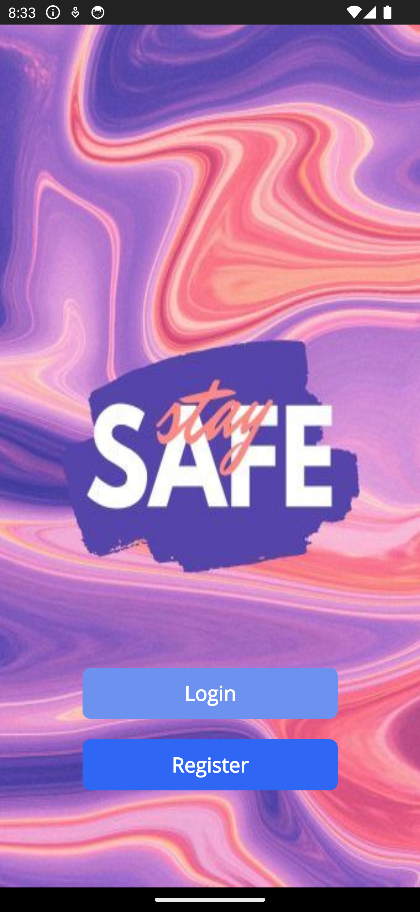
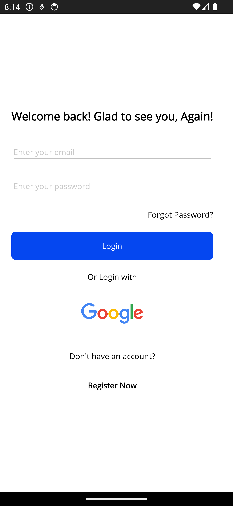
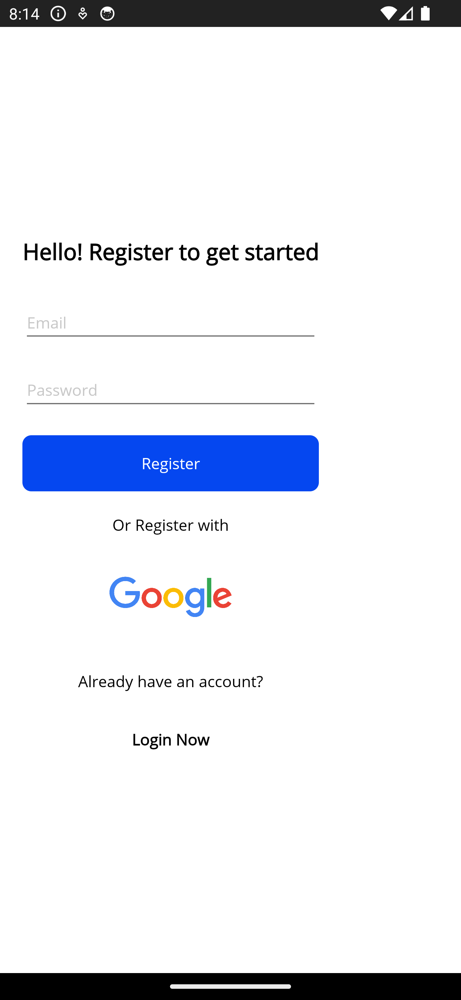
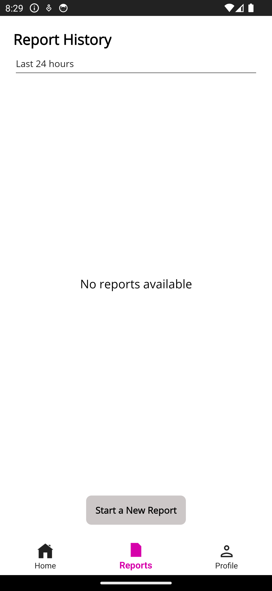
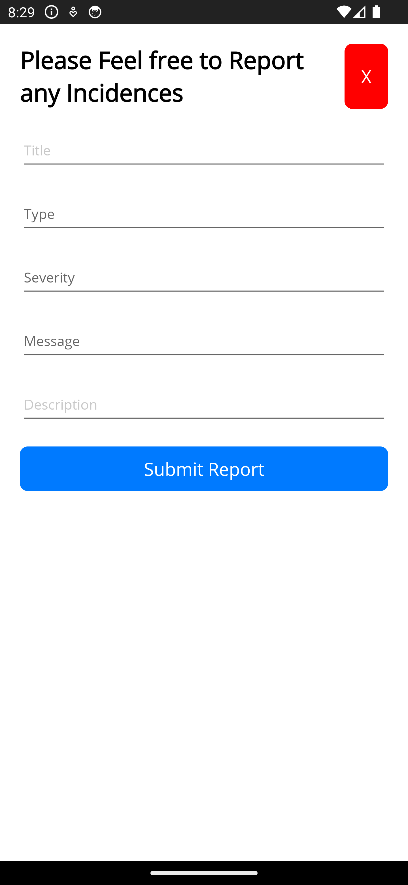
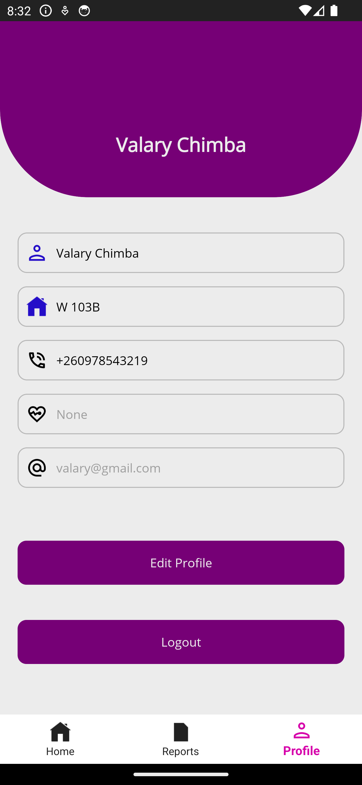

# **Student Safety and Emergency System** Project

This documentation provides an overview of the **Student Safety and Emergency System** project. The project aims to improve emergency reporting and response at **Kapasa Makasa University** by leveraging modern technologies like **.NET MAUI** and **Firebase** for cross-platform compatibility and real-time data handling.

<p>
  <div style="display: flex; justify-content: center;">
    <figure style="margin: 0 10px;">
        
        <figcaption>Landing Page</figcaption>
    </figure>
    <figure style="margin: 0 10px;">
        
        <figcaption>Splash Screen</figcaption>
    </figure>
  </div>
</p>

---

### 1. Overview

This project implements a **cross-platform** mobile and desktop application for emergency reporting and notification. The system enables students to quickly report emergencies while university staff can respond in real-time. The system uses **.NET MAUI** for front-end development and **Firebase** for back-end services, including user authentication and real-time database management.

- **Platforms Supported**: Android, iOS, Windows
- **Backend**: Firebase Authentication & Firebase Realtime Database

---

### 2. Project Setup

#### 2.1 Prerequisites
Ensure you have the following installed on your machine:

- **Visual Studio 2022** (with .NET MAUI workload installed)
- **.NET SDK 8.0**
- **Firebase account** (for backend integration)

#### 2.2 Firebase Setup
To set up Firebase for this project:

1. **Create a Firebase Project** in the Firebase Console.
2. Enable **Authentication** and **Realtime Database**.
3. Obtain the Firebase configuration file:
   - **Android**: Download `google-services.json` and place it in the `Android` project directory.
   - **iOS**: Download `GoogleService-Info.plist` and place it in the iOS project directory.

#### 2.3 Installing Dependencies
Install the required packages using **NuGet**:

```bash
dotnet restore
```

Key Dependencies:
- **FirebaseAuthentication.net**: For managing user authentication.
- **FirebaseDatabase.net**: For real-time data management.
- **CommunityToolkit.Maui**: For UI and MVVM architecture.

---

### 3. Folder Structure

```
/ProjectRoot
│
├── Pages/                # .NET MAUI XAML pages for UI
├── ViewModel/            # ViewModel classes for MVVM pattern
├── Model/                # Data models
├── Services/             # Firebase services for handling database and authentication
├── Resources/            # Images, icons, and other assets
└── Platforms/            # Platform-specific configurations for Android, iOS, and Windows
```

---

### 4. Core Components

#### 4.1 Authentication

Firebase is used to manage user authentication. The authentication process supports **email and password** login and registration.

- **AuthViewModel.cs** handles user authentication:
  - `LoginBtnTappedAsync`: Manages user login.
  - `RegisterUserTappedAsync`: Handles user registration.

<p>
  <div style="display: flex; justify-content: center;">
    <figure style="margin: 0 10px;">
        
        <figcaption>Login Page</figcaption>
    </figure>
    <figure style="margin: 0 10px;">
        
        <figcaption>Register Screen</figcaption>
    </figure>
  </div>
</p>

Sample code for login:

```csharp
var userCredential = await client.SignInWithEmailAndPasswordAsync(model.Username, model.Password);
Preferences.Set("IsLoggedIn", true);
Preferences.Set("UserEmail", user.Info.Email);
```

---

#### 4.2 Emergency Reporting

Users can submit emergency reports using the **NewReportPage**. The report submission form allows users to select the type of emergency and add relevant details.

- **FirebaseReportService.cs** handles the storage of reports in the Firebase Realtime Database.
- **NewReportViewModel.cs** manages the report submission process and validation.

<p>
  <div style="display: flex; justify-content: center;">
    <figure style="margin: 0 10px;">
        
        <figcaption>Report Tab</figcaption>
    </figure>
    <figure style="margin: 0 10px;">
        
        <figcaption>New Report Page</figcaption>
    </figure>
  </div>
</p>

Sample code for submitting a report:

```csharp
await _firebaseReportService.AddReportAsync(Report);
```

---

#### 4.3 Real-Time Notifications

The system supports **real-time notifications** for emergency reports. When a new report is submitted, the relevant personnel are notified via Firebase's real-time database updates.

- **ReportViewModel.cs** manages the subscription to real-time updates, ensuring emergency personnel receive new reports immediately.

Sample code for subscribing to real-time updates:

```csharp
_firebaseReportService.SubscribeToReports(_userId, report =>
{
    Reports.Add(report);
    HasReports = Reports.Any();
});
```

---

#### 4.4 Profile Management

Users can manage their personal details (e.g., contact info) via the **ProfilePage**. Firebase is used to store and update profile information in real-time.

<p>
  <div style="display: flex; justify-content: center;">
    <figure style="margin: 0 10px;">
        
        <figcaption>Profile Page</figcaption>
    </figure>
  </div>
</p>

Sample code for updating a profile:

```csharp
await _profileFireService.UpdateUserProfileAsync(userId, Profile);
```

---

### 5. Running the Application

#### 5.1 For Android:
1. Connect an Android device or start an Android emulator.
2. Run the project in Visual Studio.

#### 5.2 For iOS:
1. Run the project in Visual Studio on a Mac or connected to a Mac with **Xcode** installed.

#### 5.3 For Windows:
1. Select the **Windows** platform in Visual Studio.
2. Run the project to see the app in action on Windows.

---

### 6. Known Limitations

- **No Offline Support**: The current version requires an active internet connection.
- **No Admin Dashboard**: Administrators interact with the database directly as no dedicated dashboard was implemented for managing reports.
- **No SMS Support**: The system lacks SMS alerts for environments with limited internet connectivity.
- **Limited Testing**: Full-scale pilot testing and penetration testing have not been conducted.

---

### 7. Future Improvements

- **Admin Dashboard**: Implement a web-based admin dashboard for managing emergency reports and personnel actions.
- **Offline Mode**: Add offline capabilities to allow emergency reporting without an internet connection.
- **SMS Alerts**: Integrate an SMS-based alert system for users with limited or no internet access.

---

### 8. License

This project is licensed under the MIT License.

---

### 9. Contact

For questions or contributions, please contact the project maintainers via GitHub or email at **aaronmasembemujabikalibala@gmail.com**.

---